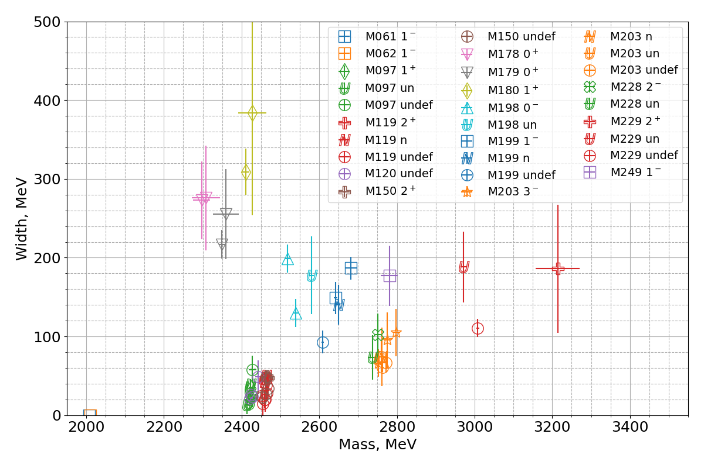

# Charmed meson spectroscopy

The [measplot.py](measplot.py) script produces the following plot:

* [measlist.py](measlist.py) - list of measurements
* [publist.py](publist.py) - list of publications
* [states.py](states.py) - list of states as in PDG
