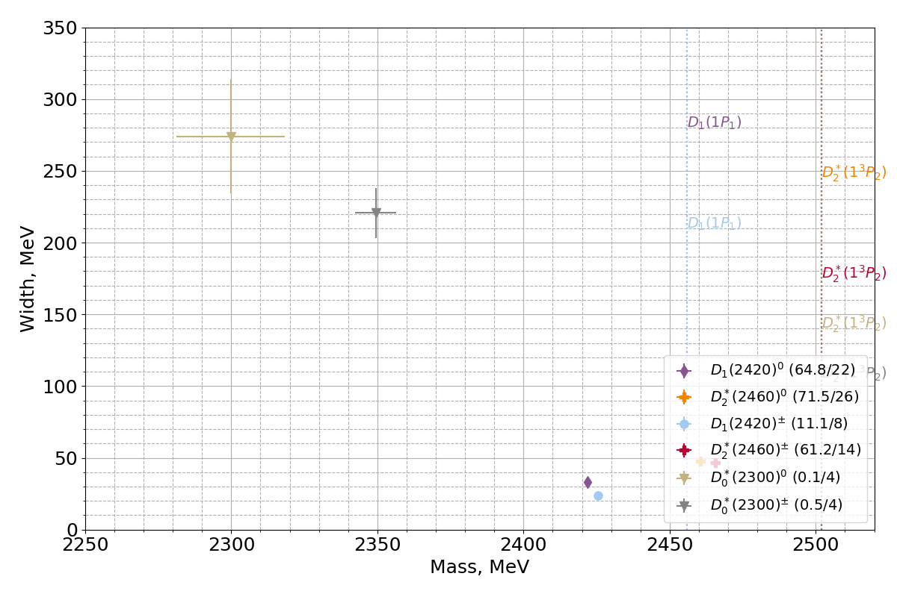
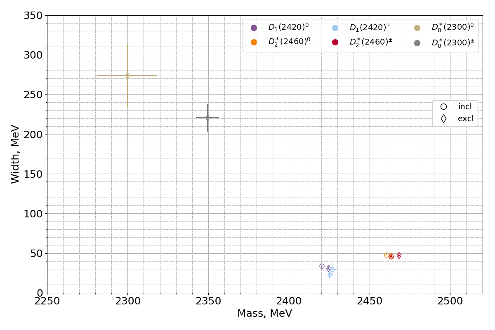

# Charmed meson spectroscopy

The [measplot.py](measplot.py) script contains functions for plotting:

* `mplot(byname=False)` makes the summary plot of all experimental results. If the parameter `byname` is `True`, the legend contains particle titles as on the plot below. Otherwise, the legend contains PDG particle codes.

* `average_plot()` produces the plot of averaged measurements together with predicted masses based on potential model and states assignments. The numbers in parentheses in legend denote `chi^2/n.d.f.` obtained from the averaged measurements.

* `excl_vs_incl()` compares inclusive and inclusive measurements:

Other files are:

* [measlist.py](measlist.py) - list of measurements
* [publist.py](publist.py) - list of publications
* [states.py](states.py) - list of states as in PDG and seleted states predicted by a potential model (Godfrey 2016)
* [average.py](average.py) - tools for averaging several measurements
* [colors.py](colors.py) - color palettes
